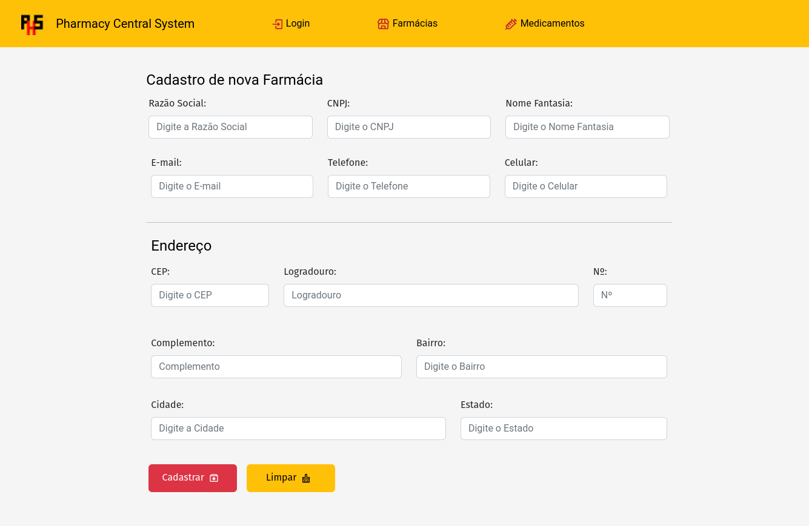

****

## Projeto modulo 1 Curso FullStack -Senai/LAB365-

***
# Pharmacy Central System

<h3>
Este é um projeto em React.js com Vite, que tem como objetivo servir como um sistema para gerenciar farmácias e medicamentos.
</h3>

****
## Funcionalidades do sistema
<ul>
    <li>Página de login</li>
     <li>Página de cadastro de usuário</li>
      <li>Página que lista as farmácias</li>
       <li>Página de cadastro de farmácias</li>
       <li>Página que lista todos os medicamentos</li>
        <li>Página cadastro de medicamentos</li>
</ul>

 ### Para instalação é necessário :

 #### Clone o repositório do projeto 
 
 ```bash
    git clone https://github.com/AdrianoVolter/pharmacy_central-system.git
 ```
 ###

Instale npm

```bash
  npm install 
```
Inicie o servidor de desenvolvimento com o comando:
```bash
    npm run dev
```

****

## Tecnologias utilizadas


<p align="">
  <a href="https://skillicons.dev">
    
  </a>
</p>

### Dependencias usando Npm
<ul>
    <li>React-DOM</li>
    <li>React-Bootstrap</li>
    <li>React-Icons</li>
    <li>React-Router-DOM</li>
</ul>

## Versionamento 

<ul>
<li>Git Flow</li>
</ul>

## Detlhes das páginas:


### Pagina de cadastro de usuário:


### Pgina Lista de Farmácias :


### Modal que exibe informações da farmácia :


### Pagina cadastrar uma farmácia ao clicar no botão:



### Pagina que lista os medicamentos :


### Modal que exibe informações do medicamento :


### Pagina cadastrar um medicamento ao clicar no botão:


## Projeto criado por Adriano Jose Volter
### Link do repositório [Click aqui !](https://github.com/AdrianoVolter/pharmacy_central-system)

### Meu perfil do GitHub  [ Click aqui !](https://github.com/AdrianoVolter)


